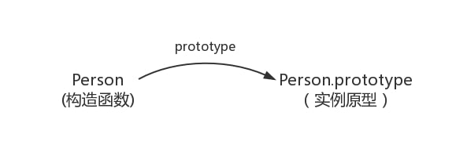
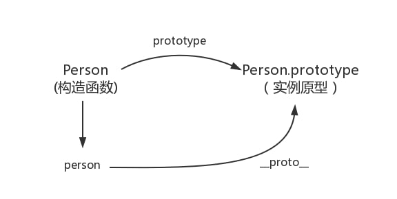
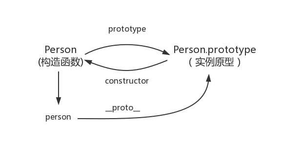
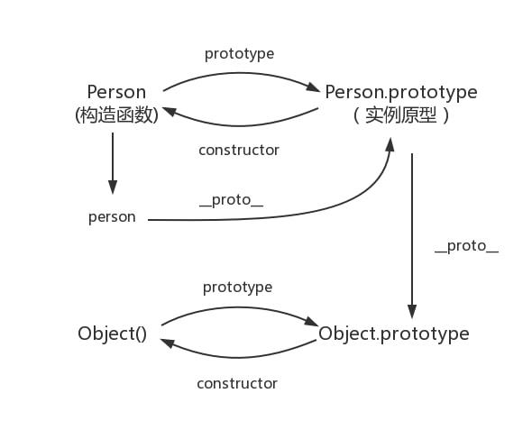
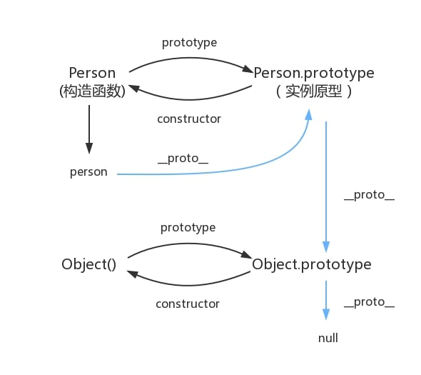

理解 JavaScript原型及原型链是所有初学者入门必定会面临的第一道门槛，就好像学英语必须学会26个英文字母一样。虽然头疼，但一旦学会，就掌握了这门语言的主动权。

本文主要通过探索构造函数（constructor）、原型对象（prototype）、和实例之间的的关系来了解原型，进而理解原型链。

## 原型

### prototype
每个函数都有一个 prototype 属性，比如：
```javascript
function Person() {

}
// 虽然写在注释里，但是你要注意：
// prototype是函数才会有的属性
Person.prototype.name = 'Kevin';
var person1 = new Person();
var person2 = new Person();
console.log(person1.name) // Kevin
console.log(person2.name) // Kevin
```
那什么是原型呢？你可以这样理解：每一个JavaScript对象(null除外)在创建的时候就会与之关联另一个对象，这个对象就是我们所说的原型，每一个对象都会从原型"继承"属性。

构造函数和实例原型之间的关系：




### `__proto__`
每一个JavaScript对象(除了 null )都具有的一个属性，叫`__proto__`，这个属性会指向该对象的原型。
```javascript
function Person() {

}
var person = new Person();
console.log(person.__proto__ === Person.prototype); // true
```
我们更新下关系图：



既然实例对象和构造函数都可以指向原型，那么原型是否有属性指向构造函数或者实例呢？

### constructor
每个原型都有一个 constructor 属性指向关联的构造函数。
```javascript
function Person() {

}
console.log(Person === Person.prototype.constructor); // true
```
再更新下关系图：



综上我们已经得出：
```javascript
function Person() {

}

var person = new Person();

console.log(person.__proto__ == Person.prototype) // true
console.log(Person.prototype.constructor == Person) // true
// 顺便学习一个ES5的方法,可以获得对象的原型
console.log(Object.getPrototypeOf(person) === Person.prototype) // true
```

## 原型链
### 实例与原型
当读取实例的属性时，如果找不到，就会查找与对象关联的原型中的属性，如果还查不到，就去找原型的原型，一直找到最顶层为止。
```javascript
function Person() {

}

Person.prototype.name = 'Kevin';

var person = new Person();

person.name = 'Daisy';
console.log(person.name) // Daisy

delete person.name;
console.log(person.name) // Kevin
```


那么，`Object`原型对象的原型是什么？继续看

### 原型链


**来一张有趣的图**


可以发现：
1. 只有函数才有prototype属性；
2. 对象都有属性__proto__，指向该对象构造函数的原型对象（prototype）；
3. 构造函数通过prototype来存储要共享的属性和方法；
4. Function.prototype和Function.__proto__都指向Function.prototype;
5. `Object.prototype.__proto__ === null`，说明原型链到Object.prototype终止

## 真的继承么
最后是关于继承，前面我们讲到“每一个对象都会从原型‘继承’属性”，实际上，继承是一个十分具有迷惑性的说法，引用《你不知道的JavaScript》中的话，就是：

继承意味着复制操作，然而 JavaScript 默认并不会复制对象的属性，相反，**JavaScript 只是在两个对象之间创建一个关联**，这样，一个对象就可以通过委托访问另一个对象的属性和函数，所以与其叫继承，委托的说法反而更准确些。